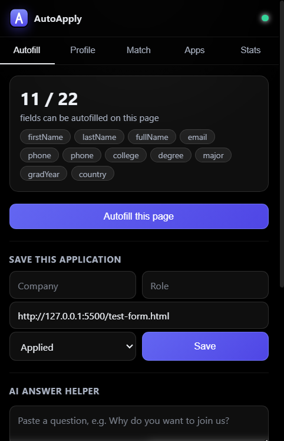
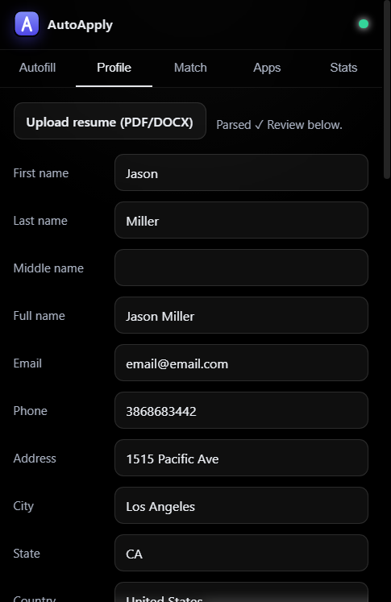
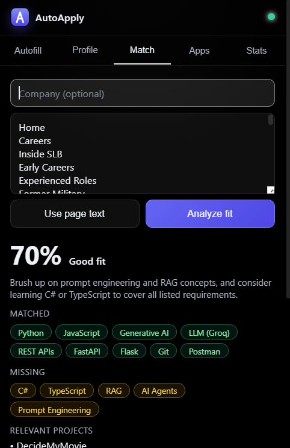
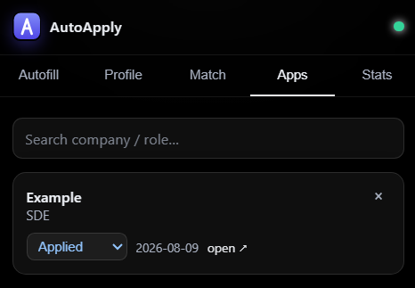
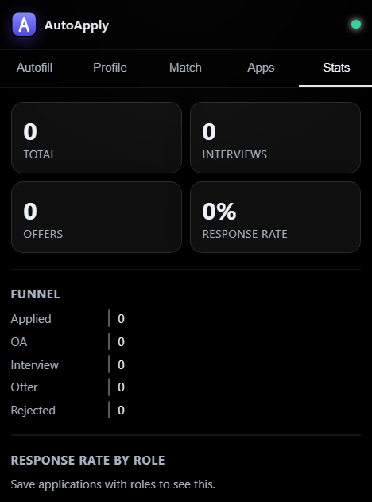

<div align="center">


# AutoApply

**Upload your resume once. Autofill job applications anywhere. Track everything.**

A Chrome/Brave extension + FastAPI backend that turns a one-time resume upload into a
reusable candidate profile, then intelligently fills application forms across job portals —
handling the messy real-world cases most autofillers choke on.

</div>

---

## Screenshots

<p align="center">
  
  
  
  
  
</p>

<p align="center"><sub>Autofill&nbsp;&nbsp;·&nbsp;&nbsp;Profile&nbsp;&nbsp;·&nbsp;&nbsp;Match&nbsp;&nbsp;·&nbsp;&nbsp;Applications&nbsp;&nbsp;·&nbsp;&nbsp;Analytics</sub></p>

---

## What it does

- **Resume &rarr; profile.** Upload a PDF/DOCX and an LLM extracts your details into a structured, editable profile.
- **Smart autofill.** Fills text inputs, native and custom dropdowns (react-select style used by Greenhouse/Lever/Ashby), radio/checkbox questions, and fields hidden inside Shadow DOM or same-origin iframes.
- **Handles the hard cases.** Correctly splits first/middle/last names even when a form uses detached labels or camelCase field names, and trims `+91` off phone numbers when a field only accepts 10 digits.
- **LLM fallback matching.** Fields the built-in rules can't place are mapped to the right profile key by the model.
- **Saved-answer memory.** Answer a screening question once (notice period, "how did you hear about us"), and it fills on future forms by meaning — matched locally, so nothing leaves your machine.
- **Job-fit analysis.** Paste or pull a job description and get a match score, matched vs missing skills, relevant projects, and a verdict.
- **Cover letters & AI answers.** Generate grounded, specific answers and cover letters from your profile + the job.
- **Application tracking + analytics.** Save each application with a status, then see totals, a funnel, and response rates by role.
- **Privacy first.** Your profile, saved answers, and application history live in the browser (`chrome.storage.local`). Backup/restore is one click.

---

## How it works

```
Browser Extension (Manifest V3)          FastAPI backend (local or hosted)
+-----------------------------+          +------------------------------+
| popup  - profile, tracking, |          | /parse-resume   resume -> JSON|
|          match, analytics UI |  HTTPS   | /generate-answer             |
| content- form detection &   | -------> | /generate-cover-letter       |
|          autofill on pages  |          | /analyze-job    fit + skills |
| storage- profile + history  |          | /match-fields   LLM matching |
|          (local, private)   |          +---------------+--------------+
+-----------------------------+                          | Groq LLM
```

The backend exists only for the AI parts (resume parsing, matching, generation), which keeps your
Groq API key off the client. Everything else runs locally in the extension. Basic autofill from a
saved profile works even with the backend offline.

## Tech stack

**Extension:** JavaScript (Manifest V3), Chrome/Brave APIs, vanilla popup UI (glassmorphism).
**Backend:** Python, FastAPI, Groq LLM, PyMuPDF + python-docx (resume parsing).
**Storage:** `chrome.storage.local` (no server-side user data).

---

## Setup

### 1. Backend

```bash
cd backend
python -m venv .venv
# Windows: .venv\Scripts\activate   |   macOS/Linux: source .venv/bin/activate
pip install -r requirements.txt
cp .env.example .env          # then add your GROQ_API_KEY
uvicorn main:app --reload --port 8000
```

Get a free key at [console.groq.com](https://console.groq.com). Check `http://localhost:8000/health` — `key_set` should be `true`.

### 2. Extension

1. Open `chrome://extensions` (or `brave://extensions`)
2. Enable **Developer mode**
3. **Load unpacked** and select the `extension/` folder
4. Pin AutoApply — the green dot in the popup means the backend is reachable

> Load-unpacked is free and permanent for personal use — no Chrome Web Store fee required.

### 3. First run

Profile tab &rarr; **Upload resume** &rarr; review the parsed fields &rarr; **Save profile**. Open a job
posting, click **Autofill this page**, review, and submit. Then **Save this application** to track it.

---

## Roadmap

- [ ] Multiple resume versions with a recommended-resume pick per posting
- [ ] Deploy the backend (Railway) for always-on AI features
- [ ] Suspicious-domain / scam signals
- [ ] CSV export of applications

## Notes

- Fully-custom widgets (e.g. Workday) and cross-origin iframes are the hard edge — coverage there is partial.
- Demographic questions (gender, race, veteran, disability) are never auto-answered by design.
- A local test form is included at `test/test-form.html` (open with a local server) to verify every field type in one place.

## License

MIT — personal / portfolio project. Not affiliated with any job portal.
